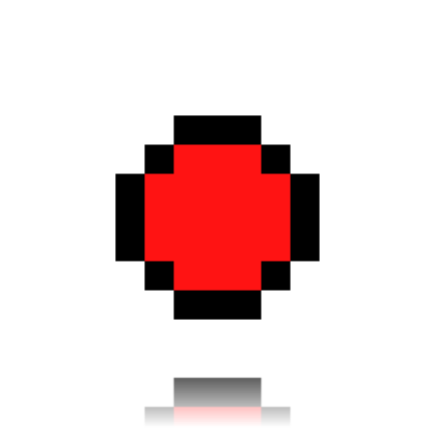
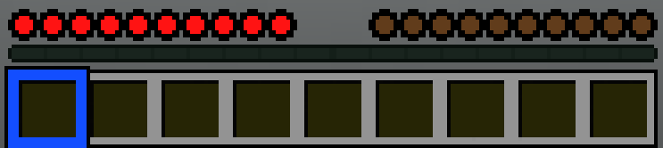

  

# SimpleHotbar

SimpleHotbar replaces all the hotbar icons and the hotbar itself with simplified versions. 

[Releases](https://github.com/ChargeUp03/SimpleHotbar/releases) | Modrinth

## Overview 

 SimpleHotbar replaces the hotbar icons with cleaner, simplistic circles. Textures on the hotbar have also been turned flat. Hearts (both player and rideable animals), hunger, their status effects, armor, air, the XP bar, jump bar, and locator bar have all been redesigned, while keeping vanilla’s colors. Hearts all have hardcore and blinking variants and all icons have transparent backgrounds. 

 

## Installation

[Minecraft: Java Edition](#minecraft-java-edition) | [Minecraft: Bedrock Edition](#minecraft-bedrock-edition)

### Minecraft: Java Edition
1. Download `SimpleHotbar.zip`
2. Open Minecraft Java, then go to Options --> Resource Packs --> Open Pack Folder --> Drop `SimpleHotbar.zip` in the folder.
3. Click the arrow on the icon to move it to Active
4. Click 'Done'

### Minecraft: Bedrock Edition
Coming soon!

## FAQ
Q: Will you release a Bedrock version? \ A: Yes! It's currently work in progress.

Q: Does this work with other resource packs? \ A: SimpleHotbar works with any resource pack, besides those that modify the hotbar and its icons.

Q: What versions of Minecraft Java is this compatible with? \ A: 1.20.2 and onward. Tested on 1.21.11.

Q: Can I use this in my modpack? \ A: Yes, but ask me first and credit me.

Q: Can I use this in videos/streams? \ A: You can showcase and use SimpleHotbar in videos or streams, but please credit me.

Q: Will you create more hotbar packs? \ A: Of course! I'm working on them right now. 

Q: What did you use to create these icons? \ A: I used a web-based tool called Piskel.

## Changelog

[Current] v1.0 - First release! (3.6.2026)

## 

<a href="https://github.com/ChargeUp03/SimpleHotbar">SimpleHotbar</a> © 2026 by <a href="https://github.com/ChargeUp03">Charge</a> is licensed under <a href="https://creativecommons.org/licenses/by-nc-nd/4.0/">CC BY-NC-ND 4.0</a> 
